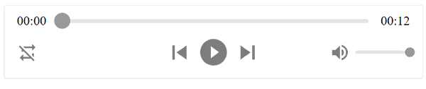

<p align="center">
  
</p>

<h1 align="center">React H5 Audio Player</h1>

<div align="center">
  <a href="https://www.npmjs.com/package/react-h5-audio-player" title="MIT License">
    
  </a>
  <a href="https://www.npmjs.com/package/react-h5-audio-player" title="Monthly download">
    
  </a>
  <a href="https://www.npmjs.com/package/react-h5-audio-player" title="Latest version">
    
  </a>
</div>

* Audio player component that provides consistent UI/UX on different browsers.
* Super customizable layout
* Flexbox css with SVG icons. Mobile friendly.
* Accessibility supported, keyboards events supported.
* Support Media Source Extensions (MSE) and Encrypted Media Extensions (EME)
* Written in TypeScript.



Live Demo: [Storybook](https://static.hanzluo.com/react-h5-audio-player-storybook/index.html?path=/docs/layouts--default-story)

Try it on CodePen: [codepen.io/lhz516/pen/dyGpmgP](https://codepen.io/lhz516/pen/dyGpmgP)

Supported browsers: Chrome, Firefox, Safari, Opera, Edge, IE 11

## [Migrate from v2.x to v3](https://github.com/lhz516/react-h5-audio-player/releases/tag/v3.0.0)

## Installation

`$ npm i react-h5-audio-player`

Or

`$ yarn add react-h5-audio-player`

## Usage

```jsx
import AudioPlayer from 'react-h5-audio-player';
import 'react-h5-audio-player/lib/styles.css';
// import 'react-h5-audio-player/lib/styles.less' Use LESS
// import 'react-h5-audio-player/src/styles.scss' Use SASS

const Player = () => (
  <AudioPlayer
    autoPlay
    src="http://example.com/audio.mp3"
    onPlay={e => console.log("onPlay")}
    // other props here
  />
);
```

#### Keyboard shortcuts (When audio player focused)
| Key binding | Action |
| ----------- | ------ |
| Space       | Play/Pause |
| ←           | Rewind |
| →           | Forward |
| ↑           | Volume up |
| ↓           | Volume down |
| L           | Toggle loop |
| M           | Toggle mute |

## Props

### HTML Audio Tag Native Attributes

| Props       |  Type                          |  Default  | Note |
| ----------- | ------------------------------ | --------- | ---- |
| src         | string                         | ''        | |
| preload     | 'auto' \| 'metadata' \| 'none' | 'auto'    | |
| autoPlay    | boolean                        | false     | Won't work on most mobile devices |
| loop        | boolean                        | false     | |
| muted       | boolean                        | false     | |
| volume      | number                         | 1.0       | Won't work on most mobile devices |
| crossOrigin | string                         | undefined | |
| mediaGroup  | string                         | undefined | |


More native attributes detail: [MDN Audio element](https://developer.mozilla.org/en-US/docs/Web/HTML/Element/audio)

The `controls` attribute defaults to `false` and should never be changed to `true` because this library is already providing UI.

### UI/UX Props

| Props                    | Type              | Default | Note |
| ------------------------ | ----------------- | ------- | ---- |
| showSkipControls         | boolean           | false   | Show Previous/Next buttons |
| showJumpControls         | boolean           | true    | Show Rewind/Forward buttons |
| showDownloadProgress     | boolean           | true    | Show download progress over progress bar |
| showFilledProgress       | boolean           | true    | Show filled (already played) area on progress bar |
| showFilledVolume         | boolean           | false   | Show filled volume area on volume bar |
| autoPlayAfterSrcChange   | boolean           | true    | Play audio after `src` is changed, no matter `autoPlay` is `true` or `false` |
| volumeJumpStep           | number            | 0.1     | Indicates the volume jump step when pressing up/down arrow key, volume range is `0` to `1` |
| progressJumpStep         | number            | 5000    | **Deprecated, use progressJumpSteps.** Indicates the progress jump step (ms) when clicking rewind/forward button or left/right arrow key |
| progressJumpSteps        | object            | `{ backward: 5000, forward: 5000 }`    | Indicates the progress jump step (ms) when clicking rewind/forward button or left/right arrow key|
| progressUpdateInterval   | number            | 20      | Indicates the interval (ms) that the progress bar UI updates,  |
| listenInterval           | number            | 1000    | Indicates the interval (ms) to call the `onListened` prop during playback |
| defaultCurrentTime       | ReactNode         | '--:--' | Default display for audio's current time before src's meta data is loaded |
| defaultDuration          | ReactNode         | '--:--' | Default display for audio's duration before src's meta data is loaded |
| timeFormat               | 'auto' \| 'mm:ss'<br>\| 'hh:mm:ss' | 'auto' | Time format for both current time and duration. `'auto'` means when duration is greater than one hour, time format is `hh:mm:ss`, otherwise it's `mm:ss` |
| header                   | ReactNode         | null    | Header of the audio player |
| footer                   | ReactNode         | null    | Footer of the audio player |
| layout                   | 'stacked' \| 'horizontal' \|<br>'stacked-reverse' \|<br>'horizontal-reverse' | 'stacked' | [Overall layout](https://static.hanzluo.com/react-h5-audio-player-storybook/index.html?path=/docs/layouts-advanced) of the audio player |
| customIcons              | [CustomIcons](https://github.com/lhz516/react-h5-audio-player/blob/fa1a61eb7f77146e1ce4547a14181279be68ecfd/src/index.tsx#L99) | {}      | [Custom icons](https://static.hanzluo.com/react-h5-audio-player-storybook/index.html?path=/docs/layouts--custom-icons) to replace the default ones |
| customProgressBarSection | [Array<string \|<br>ReactElement>](https://github.com/lhz516/react-h5-audio-player/blob/fa1a61eb7f77146e1ce4547a14181279be68ecfd/src/index.tsx#L91) | [CURRENT_TIME,<br>PROGRESS_BAR,<br>DURATION] | [Custom layout](https://static.hanzluo.com/react-h5-audio-player-storybook/index.html?path=/docs/layouts-advanced) of progress bar section |
| customControlsSection    | [Array<string \|<br>ReactElement>](https://github.com/lhz516/react-h5-audio-player/blob/fa1a61eb7f77146e1ce4547a14181279be68ecfd/src/index.tsx#L92) | [ADDITIONAL_CONTROLS,<br>MAIN_CONTROLS,<br>VOLUME_CONTROLS] | [Custom layout](https://static.hanzluo.com/react-h5-audio-player-storybook/index.html?path=/docs/layouts-advanced) of controls section |
| customAdditionalControls | [Array<string \|<br>ReactElement>](https://github.com/lhz516/react-h5-audio-player/blob/fa1a61eb7f77146e1ce4547a14181279be68ecfd/src/index.tsx#L93) | [LOOP] | [Custom layout](https://static.hanzluo.com/react-h5-audio-player-storybook/index.html?path=/docs/layouts-advanced) of additional controls |
| customVolumeControls     | [Array<string \|<br>ReactElement>](https://github.com/lhz516/react-h5-audio-player/blob/fa1a61eb7f77146e1ce4547a14181279be68ecfd/src/index.tsx#L94) | [VOLUME] | [Custom layout](https://static.hanzluo.com/react-h5-audio-player-storybook/index.html?path=/docs/layouts-advanced) of volume controls |
| mse                      | Object           | null     | A configuration object so the player can play audio chunks, MSE streams and encrypted audio (See [section about Media Source Extensions](#media-source-extensions-and-encrypted-media-extensions) in this Readme) |
| mse.srcDuration          | number           | -        | The complete duration of the MSE audio chunks together (this is a key of the _mse_ prop) |
| mse.onSeek               | Function (Event) | -        | The callback to be used when seek happens (this is a key of the _mse_ prop) |
| mse.srcDuration          | number           | -        | The callback to be used when encrypted audio is detected and needs to be decrypted (this is a key of the _mse_ prop) |

### Event Props

Supported media events: `onPlay`, `onPause`, `onEnded`, `onSeeking`, `onSeeked`, `onAbort`, `onCanPlay`, `onCanPlayThrough`, `onEmptied`, `onError`, `onLoadStart`, `onLoadedMetaData`, `onLoadedData`, `onPlaying`, `onSuspend`, `onWaiting`, `onVolumeChange`

Docs: [Media Events | MDN](https://developer.mozilla.org/en-US/docs/Web/Guide/Events/Media_events)

Note: `onTimeUpdate` is not supported. Please use `onListen` with `listenInterval` for better performance.

#### Other events

| Props                  | Type              | Default | Note |
| ---------------------- | ----------------- | ------- | ---- |
| onClickPrevious        | Function (Event)  | null    | Called when click Previous button |
| onClickNext            | Function (Event)  | null    | Called when click Next button |
| onListen               | Function (Event)  | null    | Called every `listenInterval` milliseconds during playback |
| onPlayError            | Function (Error)  | null    | Called when there's error invoking `audio.play()`, it captures error that `onError` won't catch |

## UI Overwrites

Besides using props to change UI, React H5 Audio Player provides built-in class names and SASS/LESS variables for developers to overwrite.

### SASS variables

```scss
$rhap_theme-color: #868686 !default;   // Color of all buttons and volume/progress indicators
$rhap_background-color: #fff !default; // Color of the player background
$rhap_bar-color: #e4e4e4 !default;     // Color of volume and progress bar
$rhap_time-color: #333 !default;       // Font color of current time and duration
$rhap_font-family: inherit !default;   // Font family of current time and duration
```

For LESS variables, just replace `$` with `@`.

## Advanced Usage

### Access to the audio element

You can get direct access to the underlying audio element. First get a ref to ReactAudioPlayer:

```jsx
this.player = createRef()

<ReactAudioPlayer ref={this.player} />
```

Then you can access the audio element like this:

`this.player.current.audio.current`

### Media Source Extensions and Encrypted Media Extensions

You can use [Media Source Extensions](https://developer.mozilla.org/en-US/docs/Web/API/Media_Source_Extensions_API) and [Encrypted Media Extensions](https://developer.mozilla.org/en-US/docs/Web/API/Encrypted_Media_Extensions_API) with this player. You need to provide the complete duration, and also a onSeek and onEncrypted callbacks. The logic for feeding the audio buffer and providing the decryption keys (if using encryption) must be set in the consumer side. The player does not provide that logic. Check the [StoryBook example](https://github.com/lhz516/react-h5-audio-player/blob/master/stories/mse-eme-player.tsx) to understand better how to use.

## Release Notes

https://github.com/lhz516/react-h5-audio-player/releases

## How to contribute

Issues and PR's are welcome.

## Credits

- Inspired by [React Audio Player](https://github.com/justinmc/react-audio-player).
- Icon wrapper [iconify](https://iconify.design/)
- Icons [Material Design Icons](https://github.com/Templarian/MaterialDesign)
